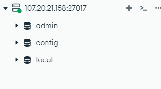

# Screenshot of Compass with the list of existing databases.

# Explanation of what the authSource=admin option does and why this parameter is so correct
authSource=admin specifies in which database we want to authenticate against, since in MongoDB the user credentials are store in a specific database. The reason of why is so correct is, that when we created our 'admin' user it was added to the database 'admin'. And that piece of string specifies that MongoDB tries to authenticate using the credentials that are stored in the 'admin' database.
# In the cloud-init you will find the Linux command sed twice. 
## Explanation of what the two commands do
### - sudo sed -i 's/#security:/security:\n  authorization: enabled/g' /etc/mongod.conf
This command is used to modify the MongoDB configuration fiel to enable the authentication.

### - sudo sed -i 's/127.0.0.1/0.0.0.0/g' /etc/mongod.conf
This command is used to allow remote connections to the MongoDB server.

## Screenshot of the contents of the MongoDB configuration file

