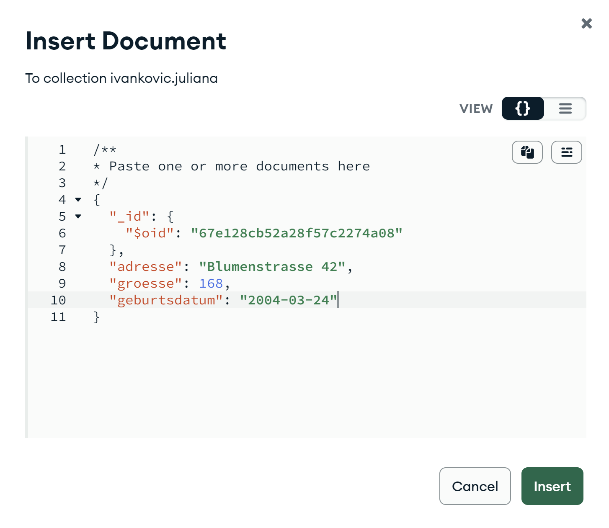
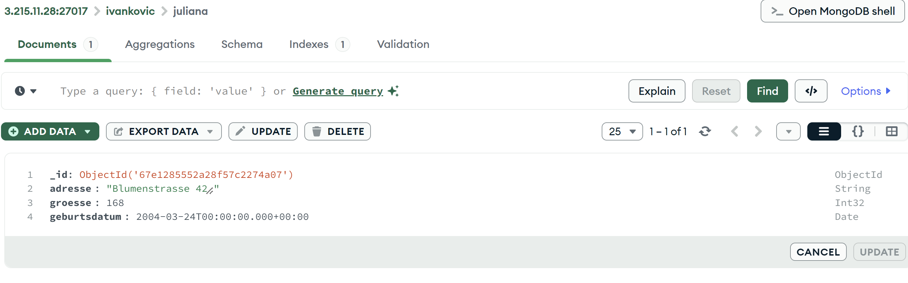

### Warum wurde das Datum nicht korrekt gespeichert?

MongoDB speichert einen String wie `"2004-03-24"` automatisch als String, auch wenn es wie ein Datum aussieht.
Damit MongoDB es als echtes Datum erkennt, müsste das Feld so eingefügt werden:

```
{
  "geburtsdatum": { "$date": "2004-03-24T00:00:00Z" }
}
```

Nur dieses spezielle Format `($date)` sagt MongoDB, dass es sich um ein Datum handelt.
Im Compass-UI wird es beim Einfügen standardmäßig als String gespeichert, deshalb musste man den Datentyp manuell auf Date ändern.

### Wieso ist dieser komplizierte Weg notwendig, um ein Datum zu definieren?

MongoDB ist eine dokumentbasierte Datenbank und verwendet JSON.
In normalem JSON gibt es keinen Datentyp für Datum, deshalb braucht MongoDB dieses spezielle $date-Format.

Wenn man über das UI ein Dokument einfügt, geht Mongo davon aus, dass `"2004-03-24"` nur ein Text ist.
Ohne explizite Angabe im $date-Format kann MongoDB also nicht wissen, dass es sich um ein Datum handeln soll.





