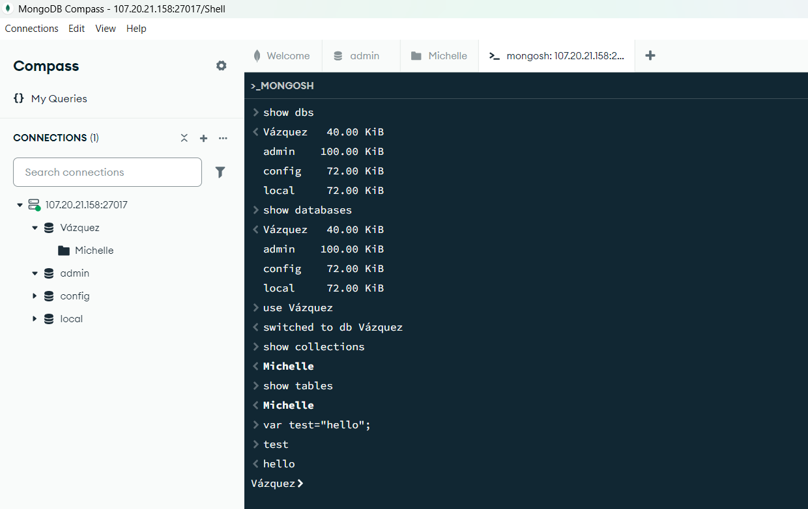
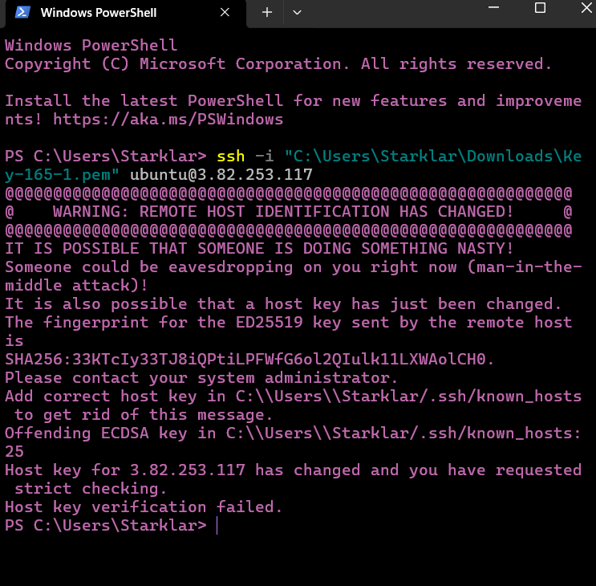

# Commands in Compass GUI

# Commands in Windows PowerShell

# Explanation of commands 1-5
- 'Show DBS;' and 'show databases;' -> give the same output, listinf all teh present databases in the MongoDB instance.
- 'use your-database' -> Switches to a specific database. If the database that we search doesn't exist it will create it.
- 'show collections;' -> It listes all collections present in the database where we're currently at.
- 'show tables;' -> This is an alias for show collections due that MongoDB do not have tables.
