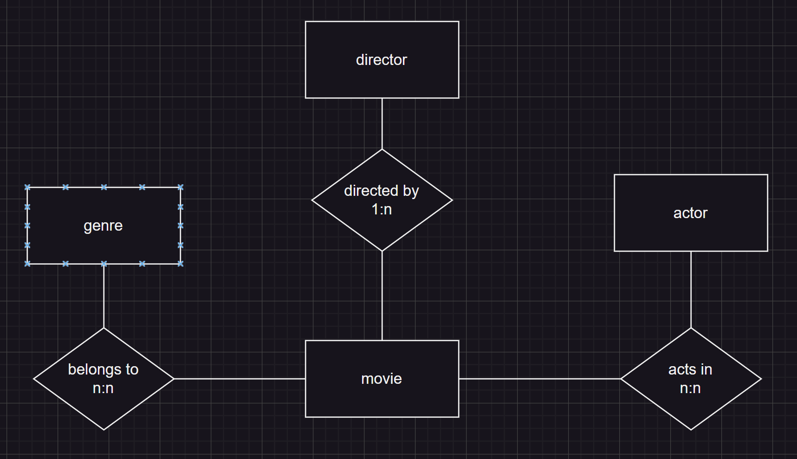

### draw.io diagram: kn02_A_m165.drawio

## explanation

Movie: Represents a film, including attributes like title, release year, and duration.
Actor: Contains information about people who act in movies (e.g. name, birth date, nationality).
Director: Stores data about the person directing the movie, including name and stylistic focus.
Genre: Represents the movie’s category such as Action, Romance, or Thriller.

Relationships:
A movie can feature multiple actors, and actors can participate in multiple movies (N:N).
Each movie has one director, but a director may have directed multiple movies (1:N).
A movie can belong to multiple genres, and each genre can contain many movies (N:N).
