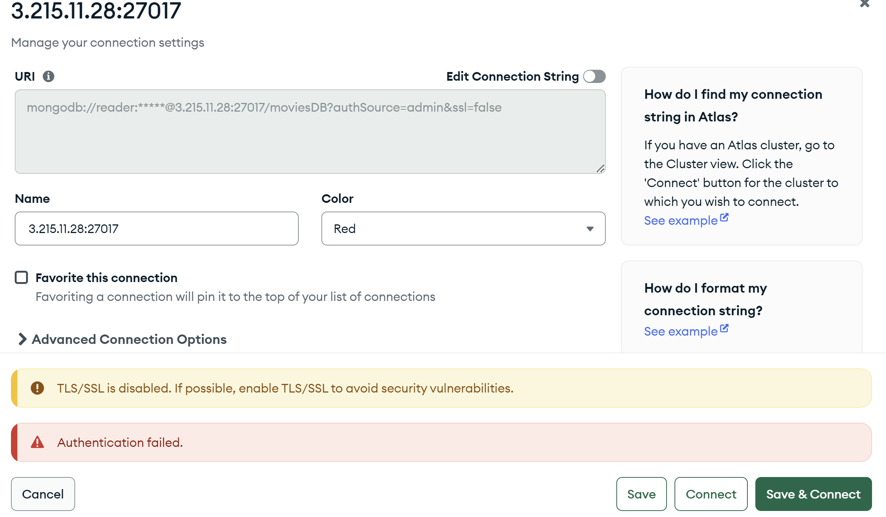
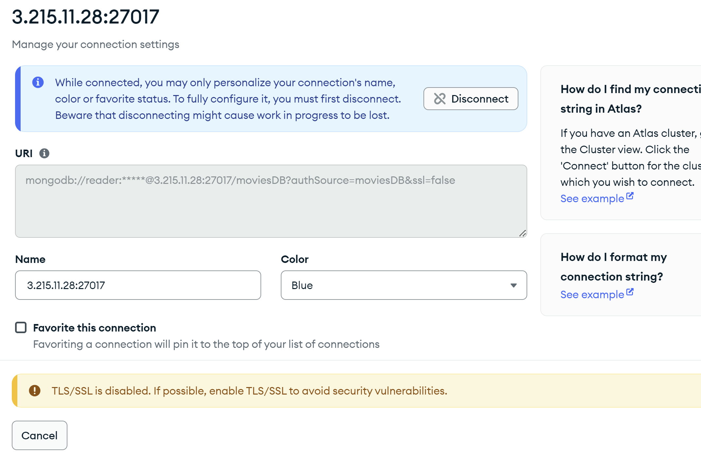
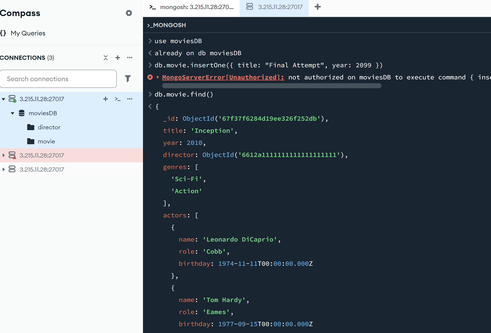
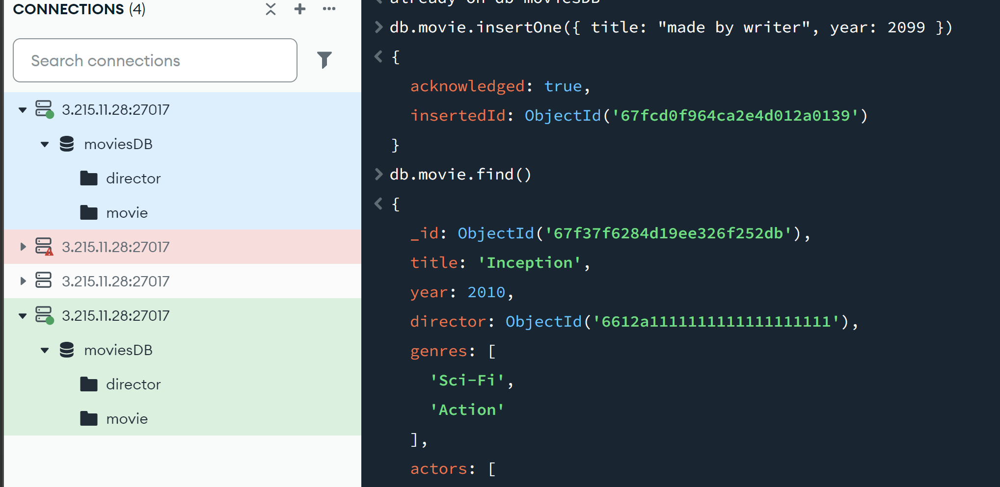
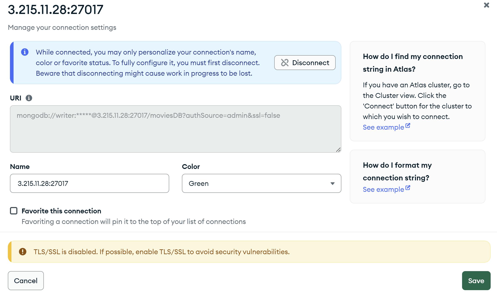

### create users script: createUsers.js
``` 
use moviesDB
db.createUser({
  user: "reader",
  pwd: "readerpass",
  roles: [{ role: "read", db: "moviesDB" }]
})

use admin
db.createUser({
  user: "writer",
  pwd: "writerpass",
  roles: [{ role: "readWrite", db: "moviesDB" }]
})
```
---
## connecting with the wrong authSource:

### connecting with the right authSource:

---
## reader permission test
we can see that the user (reader) is able to see the movies, but isnt authoriesed to create one.
the blue connection is the one im currently using where im logged in with the reader, the red one is the failed one with the wrond authSource.

---
## writer permission test
here im connected as the other user (writer) who is able to create objects too
.
### writer connection

