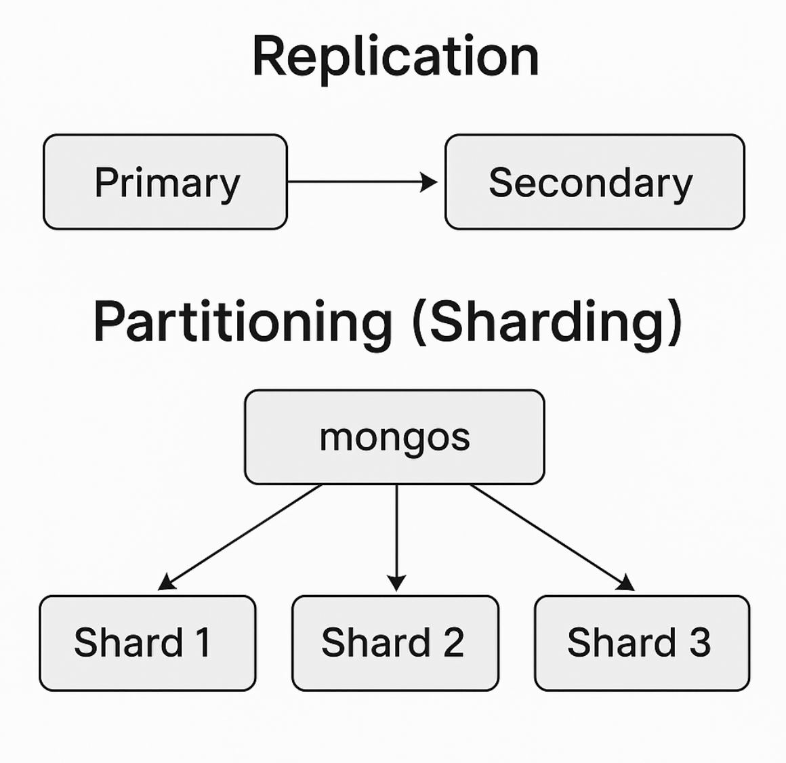

# difference Replication and Partitioning

Replication means having multiple copies of the same database on different servers (called nodes). In MongoDB, this setup is called a replica set.

The primary node handles all the writing. Secondary nodes get copies of the data from the primary and can be used for reading. If one node goes offline, another one takes over automatically, so the system keeps working.

Replication helps with handling more reading requests, but it doesn’t really help with storage space or a lot of writing. It’s mostly used to keep the system available, handle failures, and improve reading performance.

Partitioning (also called sharding) splits the data across multiple replica sets (shards), where each shard only stores part of the data. This is done using a sharding key (like price or ID ranges).

There’s something in MongoDB called mongos that decides which shard should handle a request. This kind of setup is called horizontal scaling. The more shards you add, the more storage and power you get for reading and writing. It’s really helpful when you’re working with a lot of data and want good performance, but it’s more complicated to set up than replication. It’s usually used for big systems that need to store and process a lot of data.

