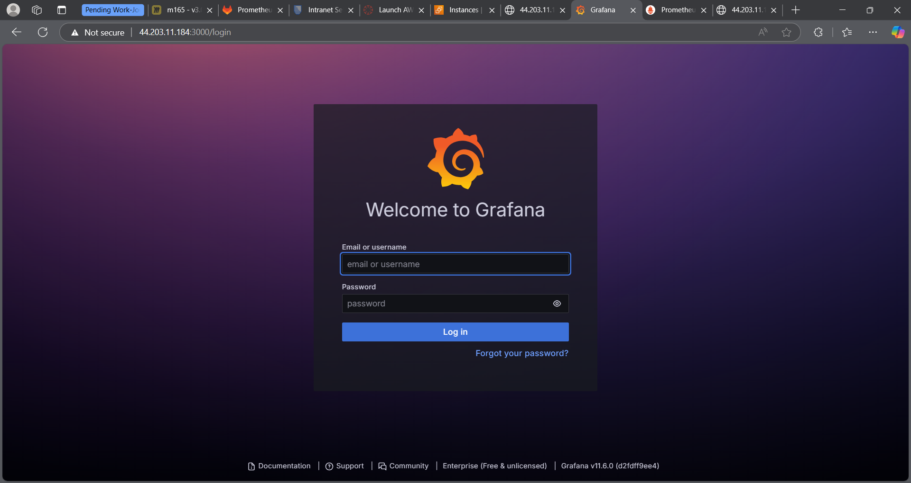
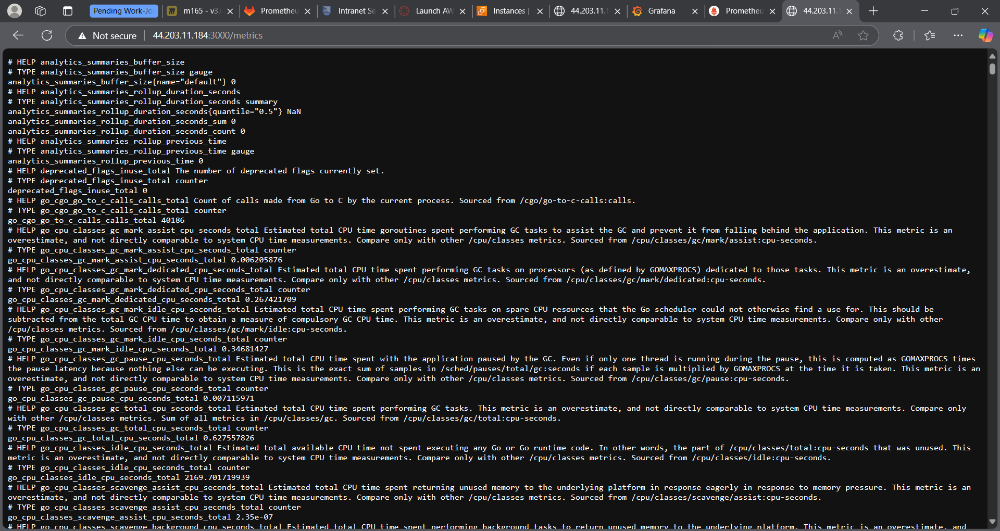
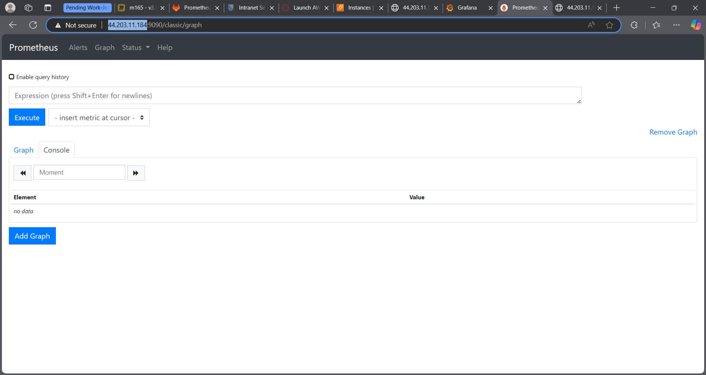
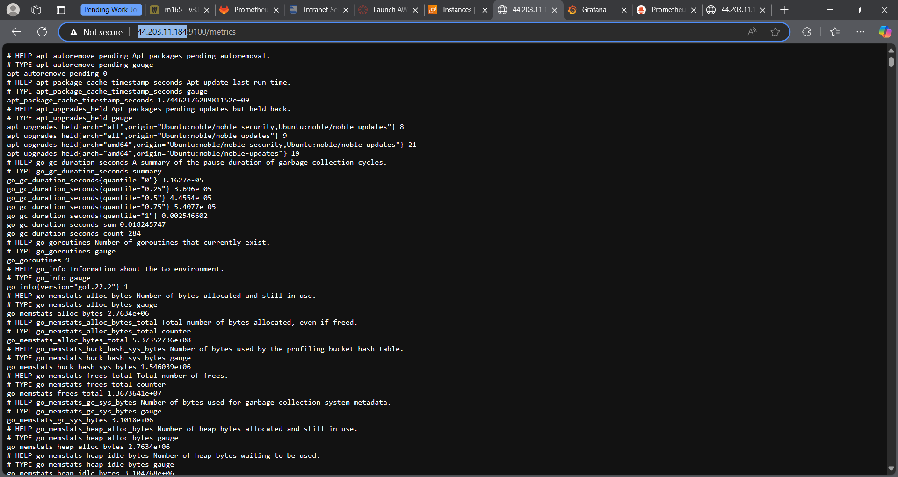

# URL/IP Screenshots
  
  
  
  
# Cloud Init Explanations
* What are scrapes? Explain the term in the context of Prometheus and give concrete examples.
  In Prometheus we call scrapes to the process of periodically collecting metric data from different monitored targets or services. Prometheus fetches metrics exposed by applications or systems on HTTP endpoints at regular intervals.
Example:

* What are Rules? Explain the term in the context of Prometheus and give concrete examples.
* What are the steps you need to take as a programmer to store your own data in Prometheus?
* Which variables are used in the scrapes and rules and from which pages/URLs do these variables come?
* How does Prometheus know if a system is up (see rules in the Alerting Rules).
